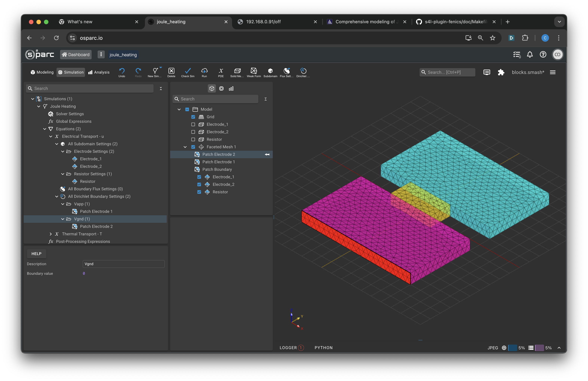

# Non-Linear Joule Heating

This example demonstrates how to use the Sim4Life-FEniCS plugin to solve a coupled, non-linear system of equations.

## Physics

A pair of electrodes with a high electrical conductivity are separated by a low conductivity resistor region. A voltage is applied to the outer edge of the electrodes.  This drives current through the resistive region leading to joule heating.  The system's temperature is clamped at T=0 at the outer edges.  Heat leaves from the remaining boundaries at a rate dependent on the local temperature (a surface heat transfer coefficient).  The electrical conductivity depends on the temperature.  Here we use toy parameters for the conductivity (electrical and thermal).  For a fenics simulation using realistic parameters for highly doped silicon see:

[spieser2017](https://pubs.aip.org/aip/jap/article-abstract/121/17/174503/948320/Comprehensive-modeling-of-Joule-heated-cantilever?redirectedFrom=fulltext)

---

## Step-by-Step

### 1. Model

The geometry consists of a pair of cuboidal electrode regions, separated by a single smaller cuboidal resistive region.

---

### 2. Simulation Settings

A new fenics simulation is created and a pair of PDE equations are added, one for the electrical transport simulation the other for the thermal transport equation.

#### 2.1 Solver Settings

We set the solver type to non-linear and use the direct solver.

#### 2.2 Global Expressions

We define the following expressions for the conductivity. Two for the electrical conductivities in the electrodes and resistor regions and one for the thermal conductivity which is the same for both regions.  The electrical conductivity in the resistive region depends on the temperature yielding the coupled problem.

#### 2.2 Electrical Equation Settings

The electrode and resistor regions have the conductivity assigned from the global expressions and otherwise 0 values for the remaining terms.

#### 2.3 Electrical Boundary Conditions

Dirichlet boundary conditions are used to apply a voltage difference of 1V to the outer edges of the electrodes:

### 2.4 Thermal Equation Settings

The thermal simulation is driven by the joule heating from the electrical simulation.  

The rate of heat production, $q$, within the simulation domain is given by:

$$
q = j.E
$$

Where $j$ is the current density and $E$ is the electric field.  Substituting Ohm's law ($j=\sigma E$) and expressing $E$ in terms of the scalar potential $u$ we get:

$$
q = \sigma \nabla u . \nabla u
$$

Where $\sigma$ is the electrical conductivity.  To express this equation using FEniCS we need to use the `ufl.dot` function as well as the `ufl.nabla` functions.  This yields the following settings for the electrode and resistor regions:

### 2.5 Thermal Boundary Condition Settings

We assign two types of boundary conditions to the thermal simulation.  The first clamps the temperature to $T=0$ along the same surfaces that we apply the voltage to in the electrical part of the simulation.

Furthermore we model heat transport into the air from the remaining free surfaces in line with a surface heat transfer coefficient.  Under this model the rate of heat transfer from a surface is proportional to the temperature of this surface.  This flux boundary condition has the following settings:

### 2.6 Solve

The simulation can now be run by selecting the `Run` button from the ribbon.  If the solve fails double check that the `Non-Linear` solver has been selected in the Solver Settings.  The relatively weak coupling between the thermal and electrical simulation should allow fast convergence from the Newton solver (4 iterations).

## 3. Post-Pro

The solution for the scalar potential should look like:

with the majority of the potential drop occuring across the resistor region.

The thermal solution should show a hot spot in the resistive region:

